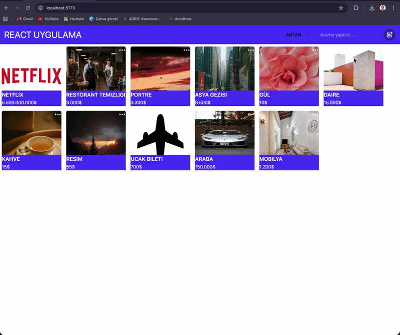
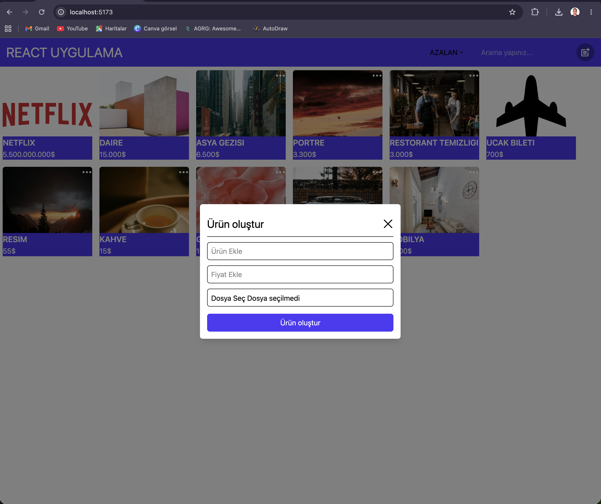
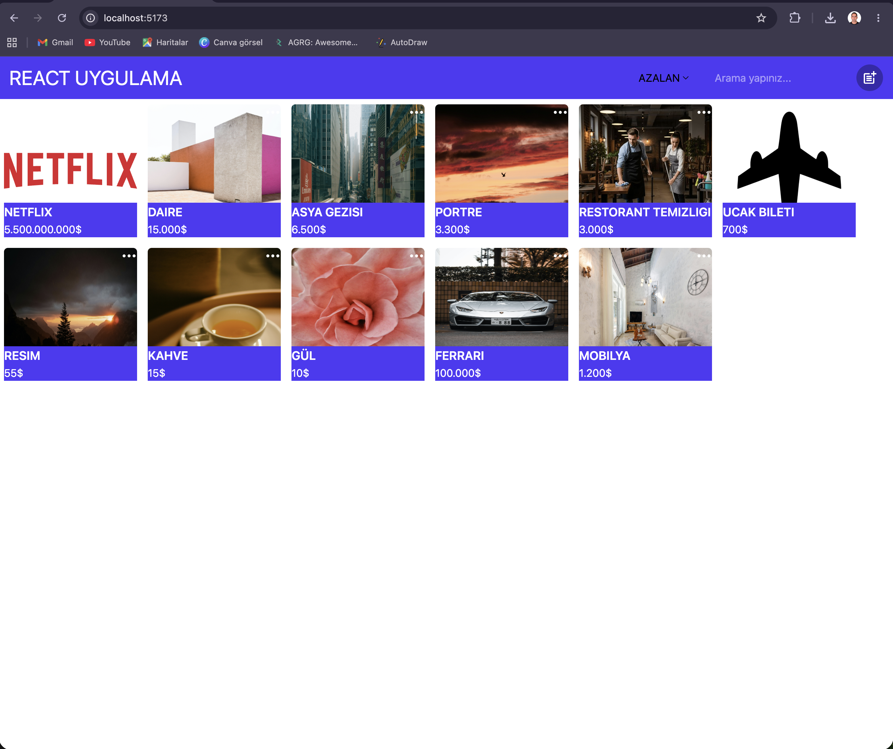

# 🛒 React Redux — Ürün Yönetim Uygulaması

> Gerçek zamanlı ürün ekleme, listeleme, güncelleme ve silme işlemleri yapabileceğiniz tam işlevsel bir React + Redux uygulaması.

---

## 📸 Ekran Görüntüleri

| Ana Sayfa | Modal |
|:---------:|:-----:|
| width="400"/> |  width="400"/> |

---

## 🚀 Özellikler

- ➕ Ürün oluşturma (isim, fiyat, görsel)
- 🗑️ Ürün silme
- ✏️ Ürün güncelleme
- 🔍 Ürün arama
- ↕️ Fiyata göre artan / azalan sıralama
- 📦 Redux Toolkit ile global state yönetimi
- 🎨 Tailwind CSS ile responsive tasarım
- 🔀 React Router DOM ile sayfa yönetimi

---

## 🛠️ Kullanılan Teknolojiler

| Teknoloji | Açıklama |
|-----------|----------|
| React | UI bileşenleri |
| Redux Toolkit | State yönetimi |
| React Router DOM | Sayfa yönlendirme |
| Tailwind CSS | Stil |
| Vite | Geliştirme ortamı |
| React Icons | İkon kütüphanesi |

---
## 📬 İletişim

- 📧 [numanbalik72@gmail.com](mailto:numanbalik72@gmail.com)
- 💼 [linkedin.com/in/numan-balik-sverige](http://linkedin.com/in/numan-balik-sverige)
- 🐙 [github.com/numanbalik-web](https://github.com/numanbalik-web)

---

## 🙏 Teşekkürler

- [isveckrali](https://github.com/isveckrali)
- [Udemig](https://github.com/Udemig)

